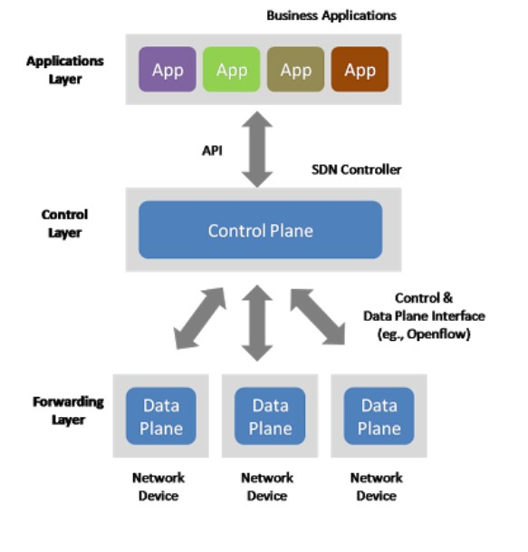

# Software Defined Networks

Software defined networks (SDNs) are the next evolution of computer networks, as they address many of the shortcomings of traditional networks and provide many advantages over them. SDN has changed the way organizations are designing, building, and operating networks to increase organizational agility and speed of innovation.

