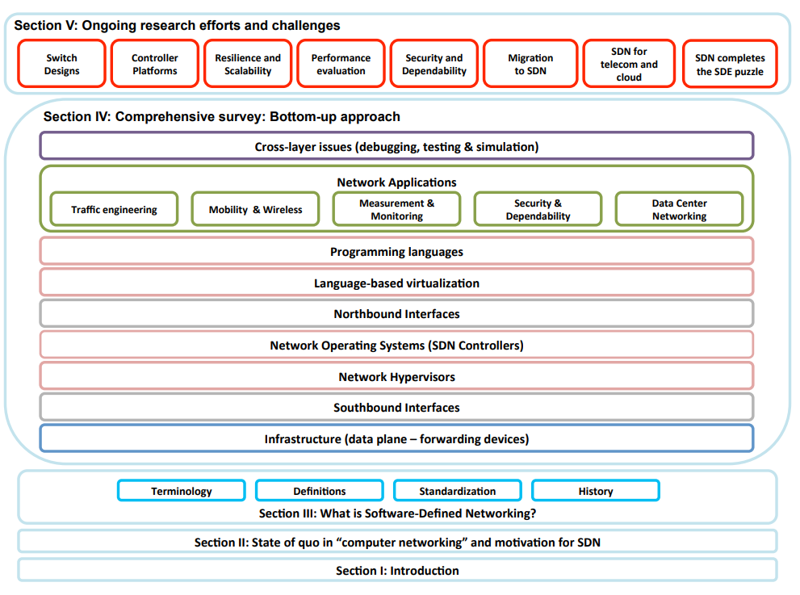

# Independant Readings

## What is Network Virtualization (NVF)

### Trends on virtualisation with SDN and NFV; Lopez, et. al (2014)

[Lopez, et. al states](Trends_on_virtualized_networking.pdf) the idea of active networks has been around for some length of time, however the configuration has largely been proprietary. This has introduced challenges for heterogeneous networks, which are common place in the enterprise environment.

There is also significant lead time from an idea to implementation, which can introduce risk and delay the time to reap rewards. To mitigate these challenges software vendors have moved portions of the networking infrastructure into virtualized network functions (e.g. firewalls).

Improvements have also come through technologies such as Domain Name Services (DNS) and Virtual Local Area Network (VLAN) tagging. However, these only partially solve the address as it can be difficult to 'lift and shift' legacy systems without a distruption.

There are also design requirements within the virtual network that are created by the physical one. This is visible in scenarios such as overlapping address ranges and the mixture of certain protocols (e.g. IPv4 and IPv6).

These virtualized functions are blocked from innovation as it is difficult to replace thick layers. The remainder of the article describes how SDN breaks these barriers by decomposing thick layers into dedicated and replaceable components.

## What is Software Defined Networking (SDN)

### Software Defined Networking; Eissa, et. al (2014)

The [authors explain](SoftwareDefinedNetworking_Explained.pdf) that SDN expose abstractions of (1) the forwarding plane; (2) the network state; and (3) the control plane.

This allows for each subsystem to be decoupled and therefore independently extended or replaced. Traditional systems were clunky all or nothing.

Within an SDN there are distinct multiple layers, specifically (top to bottom):

- Network Applications: Firewalls, load balancers, security services, etc.
- Programming Languages: High Level Languages (e.g. Java or Python) can customize the configuration of the control plane.
- Northbound Interface: Abstract the programming interface to the controller (avoiding vendor specific code)
- Controller: Configurable system for expessing paths
- Network Hypervisor: Layer for hosting virtualized networking devices (think device drivers).
- Southbound Intreface: Abstraction between the controllers policy and the network devices implementation.
- Network Infrastructure: The physical networking devices.

### SDN: A Comprehensive Survey; Kreutz, et. al (2014)

This is an [incredibly detailed accounting](Survey_SDN.pdf) of SDN and the direction of each aspect.

The first four sections were studied during this week, and the final chapter will be revisited next week.

### SDN State of the Art and Research Challenges; Jammal, et al (2014)

The [article](State_of_art_research_challenges.pdf) begins with an overview of the benefits from using SDN and OpenFlow. This is followed with additional details of the architecture similar to Eissa's description, and not repeated here.

Next definitions are provided for the entities involved in traffic management. These details extend [Azodolmolky chapter 4](SDN_OpenFlow.md) material with more concreete descriptions.

- _A flow_ is A partition of network traffic
- _An OpenFlow Switch_ holds one or more `flow tables` and `group tables` to associate which actions need to be performed
- _An OpenFlow Channel_ is an interface between the switch and controller for transferring policy.
- _An OpenFlow Controller_ maintains all protocols and policy information.
- _The OpenFlow Protocol (OFP)_ is the algorithm used by the switch to make forwarding decisions based on the controller policy.

They also decompose network virtualization into multiple distinct responsibilities. 

- Infrastructure Provider
- Virtual Network Provider
- Virtual Network Operator
- Service Provider
- Virtual Network User/End User

This is followed with a breakdown of concrete advantages of NVF and SDN.

- Multi-Tenant and Higher Utilization
- Encouraging Innovation and Improve Agility
- Network Segmentation and Security Isolation
- Traffic Shaping and Ensuring QoS
- Elastic and dynmamic networking configuration (e.g. Networking as a Service NaaS)
- Reduce costs and "go green"
- Increase transparency through consistent metrics

## How do I interace with SDN

### SDN with OpenFlow; Azodolmolky (2013)

In [this textbook](SDN_OpenFlow.md), Azodolmolky covers the implementation of SDN through OpenFlow. he continues with Python based examples for implementing different aspects of the SDN system. Given the breath of information its material has been split into separate document.

The three most common controllers are: OpenDaylight, POX, and Floodlight.
