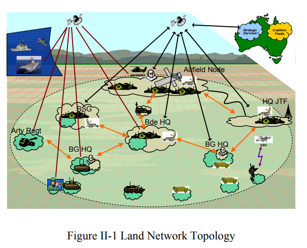

# Open Systems Interconnection

## The OSI Model – What It Is; Why It Matters; Why It Doesn’t Matter (2011)

During the 1970s the DoD created a model for describing network connectivity. Around 1980 it was expanded by the ISO standards group.

One of the challenges with this model is that its very 'academic', as most real-world network applications do not perfectly fit into the 7 layers. Since many applications do not really fit into such a complex model, large portions of the specification are unimplemented. Despite these issues, it remains one of the most recognized and used networking models even today.

> RQ: What modern models exist over OSI?

Examples protocols that target each of the layers are also provided.

## Research based on OSI Model (2011)

The primary objective of the OSI model is to create clearly defined abstractions, so that heterogeneous systems can work together. If every application had to consider the implementation specifics of low level routing, we would never get anything done.

A bulk of the article is focused on example use-cases for each of the seven layers. Toward the end an alternative model based on `Transmission Control Protocol/Internet Protocol` (TCP/IP) is discussed. With the TCP/IP model there are four layers:

- Application Layer (Segments)
- Transport Layer (Packets)
- Network Layer (Frames)
- Host-to-Network Layer (Bits)

## Battlespace communications network-of-networks interface modelling (2017)

The Australian Defence Force (ADF) is creating `Battlespace`, a Network-of-Networks Interface Model. An [example of NIN](https://www.encyclopedia.com/computing/news-wires-white-papers-and-books/network-networks) would be the modern Internet.

Their goal is to build military system that is highly reliable and effective during warface scenarios. To accomplish this they are building a mesh of aquistions in voice, data and video services. These (1) services are connected (2) delivery points, that are then attached to (3) operational nodes.

The communication infrastructure is physical but mobile, allowing it to be redeployed to any required locality. Afterwards, a parent child relationship allows a segment to connect into the mesh and gain access to the broader system services.

### External Interface

These systems are capable of horizontally sharing resources through custom protocols that run over TCP. This is performed through `External Interfaces` (EIF) on the Network Node that bridge to peers. In a lot of ways their physical implementation sounds similar to a `spoke and hub` network model that runs over Virtual Private Networking (VPN).

Since different nodes will posses different services, they created a service discovery protocol that supports querying versioned interfaces. For instance, if `Foo v3` cannot be accessed then it will automatically fallback to `Foo v2`.

### Internal Interface

Traffic flows between `EIF` interfaces as a mechanism to move between each deployment. Then it transitions to `Internal Interfaces` that are based on the OSI model. This decoupling of protocols enables highly efficient cross communication with support to run legacy systems.

### Challenges and Future Work

1. The system needs to incorporate network Quality of Service.
2. The modeling language should be upgraded to SysML (industry standard).

