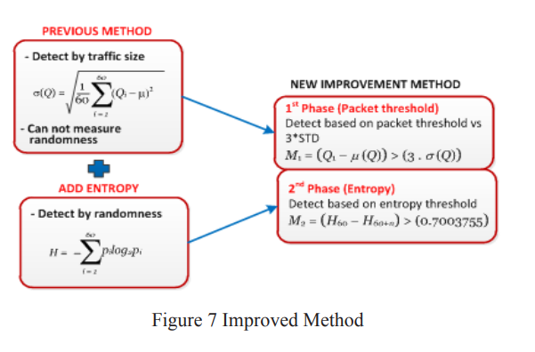
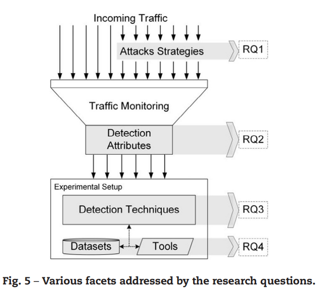

# Security Challenges from Distributed Denial of Service

## ANSwer: Combining NFV and SDN Features for Network Resilience Strategies (2016)

The authors proposed a solution that uses monitoring at the SDN controller level to detect network anomalies. When an anomaly is detected the system will attempt to remediate by deploying various complementary NFV devices.

For instance, if a virtual honeypot is being attacked; then the SDN module will deploy additional an IDS/IPS solutions to that flow. If the `resilience strategy` is unsuccessful then the network can continue stepping up the defenses until the issue subsides.

What makes their approach novel is the notion of `feedback control looping`. This attempts to build a model of normalice in terms of types of traffic (e.g. ports) and volumes (e.g. connections and bytes). Then when an OpenSwitch reports that it is out of compliance (based on some statistical variance) the controller will attempt to remediate.

Presently the rules and strategies are controlled by the operator. The authors propose that future work could instead use reinforcement learning. There is also additional effort required for scenarios such as load balancers, malware detection, and deep packet inspection.

## Detection and defense of DDoS attack–based on deep learning in OpenFlow‐based SDN (2017)

Instead of using reinforcment learning, the authors used an LTSM deep learning model on the [ISCX2012 DDoS data set](https://www.unb.ca/cic/datasets/ids-2017.html).

They were able to extract a variable `n features` from `m messages` and then normalize them into a multi-model solution built on Keras. Afterwards, the trained model could detect malicious message sequences with a 98 to 99% accuracy.

This could be paired with ANSwer to provide higher degrees of confidence that `resilence strategy` is required. For instance, an increase in traffic due to viral video should be met with scale up not blocked.

## Improving Distributed Denial of Service (DDOS) Detection using Entropy Method in SDN (2017)

The researchers propose a DDoS detection method by measuring the randomness of the packets. After detecting a potential attack the entropy is measured. This method can reduce false positives rates and enhance attack detections.

There are two classes of ddos:

- application level: hard to distinguish from legit traffic
- network level: easy to detect due to sheer volume

Previous efforts have focused on statistical methods, artifical intelligence and self organizing maps. However, one of the challenges for each of these models is that full pcap tracers are difficult to find as service provides are concerned about the privacy of the data stream. This has lead to many simulations that are unreliable in the real world or models that require data (that is not available) for training.

To determine the entropy of the flow the authors use Chi-Square calculation based on the number of packets versus the expected number of packets. The formula comes from Feinstein (2003). This does not seem to be a reasonable strategy as the attacker can easily control this vector through techniques such as null padding.

## Statistical Approaches to DDoS Attack Detection and Response (2003)

The Entropy method appears to be an extension of Feinstien's work so lets dig into that. One of the initial arguments made is that statistical methods are likely to be efficient because randomly generated data is unlikely to model legitmate traffic close enough. Yet they also argue that ddos tool kits are continued to become more advanced every day.

The solution imposes several constraints:

1. No pushback between defending components
2. No built-in knowledge of applications and protocols
3. No instrumentation at the end host

However, due to many modern systems being composed of open source/commodity products it is possible to determine (2) and (3). This makes the contraints unrealistic to modern distributed system design. The authors argue that this might be more difficult than it sounds as mulitple monitors can be deployed to check the traffic across different network hops.

For Person's Chi-Square Test to be efficiently deployed the number of categories needs to be relatively small (e.g. ~5). The authors propose "binning" values such as HTTP, FTP, DNS, and other; or breaking port ranges into continous blocks.

The frequency of the bin relative to the number of bins will provide the distribution. The bins to consider is derived from a sliding window of 60 data points (e.g. 1 per second).

## Application layer HTTP-GET flood DDoS attacks: Research landscape and challenges (2017)

This is a survey of 63 other studies that have been published on `application layer ddos`. They classify the types of attacks into groups: application, volume, and protocol based.

### Understanding the scope of the problem

According to Akamai there has been almost a 60% increase of application layer attacks between Q1-2014 and Q2-2015. This introduces challenges as it is not possible to simply block all HTTP traffic to a public web endpoint. Instead mechanisms are required to differentiate on a per-session basis what e.g. HTTPGet operations are malicious.

The term `application level ddos` is interchangeable with `http-get flooding` across the literature. Many attackers will target this level as it mitigates the network level protections and is often unfiltered. A partial mitigation is to deploy Web Application Firewalls (WAF).

### Why does the scenario exist

Vulnerable servers will open a connection to the client, and then queue the requests. The queue is only dequeued when a `dedicated thread` becomes available to handle the request. This allows a rapid fire of requests to backfill the queue and delay legitimate traffic.

The system needs a mechanism to determine if the traffic is bot or human, this can be a significant challenge in itself as bots are often designed to mimic human behavior. Existing mechanisms have often been defeated in a continuous game of cat/mouse.

### Research Questions

> RQ1. What are the different attack strategies that attackers employ to launch HTTP-GET flood DDoS attacks?

The attacker can operate across a continuum of (1) speeds; (2) intensities; (3) request variability; and (4) iteration delays. This results in a spectrum of different levels of `attack complexity`. Some of these combinations are very easy to detect (1 page at high speeds) versus others are not (many frequently accessed pages on random intervals).

> RQ2. Which user and traffic attributes have been utilized in literature for the detection of HTTP-GET flood DDoS attacks?

The literature describes detecting `network ddos` is completely different from `application ddos`. The strategies have very little overlap e.g. `packet properties` versus `is_bot categorization`. Some aspects do overlap such as ratios of upload/download bytes and number of active connections.

A successful strategy is to rely on requests to hot pages, on average 90% of the traffic will be sent to 10% of the site. If a cluster of users are only accessing obsolete content then there is the potential they are a bot.

> RQ3. What are the various approaches and modeling methods that form the basis of detection techniques available in literature?

Admission controls (e.g. permission models and CAPCHAs) and user scoring two of the models that were described. User scoring attempts to rate the traffic patterns of an individual to the norms of the population. If it has deviated then it is considered malicious and should be quarintined.

> RQ4. What kinds of datasets and software tools have been used in the evaluation of various attack detection techniques?

Table 7 on page 363 includes a listing of online benchmark data sets.

### Open Challenges in this space

- Mimicking bots
- NATs and Proxies
- Unavailability of Attack Datasets
- Lack of Standards defining attack strategies
- Complexity to monitor state
- Impractical offenses, assuming the attack is naive
- Training/Configurating Control Parameters is webapplication specific (no one size fits all)
- Identifying Legitimate Bots (most web traffic is legitimate bots)
