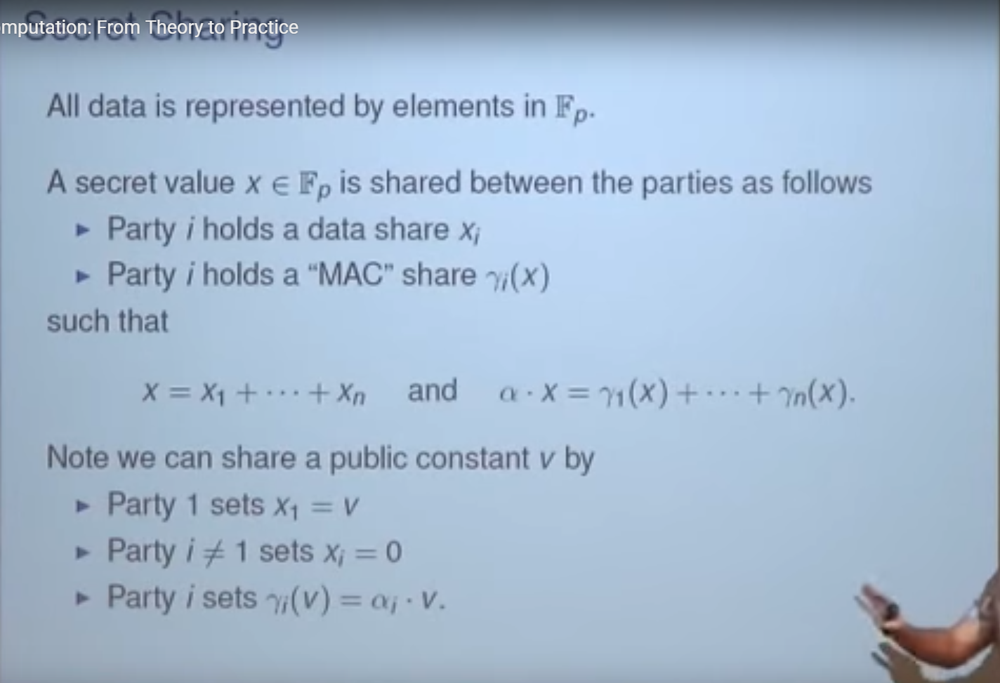
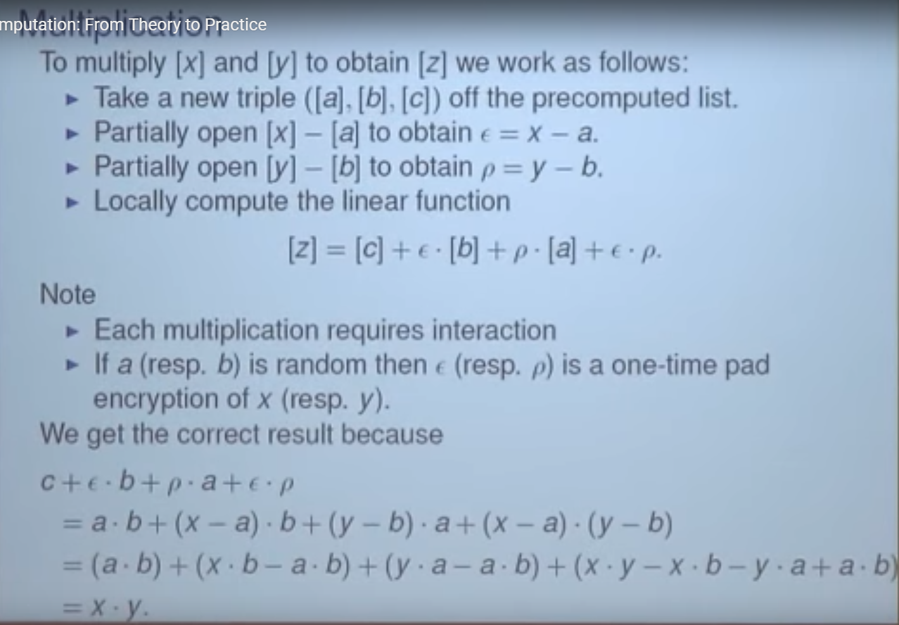

# Challenges in Security

## A Secure Computation Framework for SDNs (2014)

The OpenFlow Controller implements the Network Operating System for an SDN topology. Malicious users are interested in attacking this component, as it enables:

1. Network topology discovery (information disclosures)
2. Distributed Denial of Service (DDoS) scenarios
3. Enables Man in the Middle (MiTM) (tampering/spoofing)

The [article](Secure_Computation_for_SDN.pdf) describes a scheme for using Multi-Party Computation (SMPC) to ensure:

1. Compromised controller does not leak information
2. The system can withstand `k-1` controllers offline

The authors propose that the network state can be cryptographicaaly distributed (by a dealer component) across multiple controllers, and then reconstructed at the switch. The thesis is that this ensures no party has the entire view of the system.

### What is Secure Multi-Party Computation (2019)

Boston University has a [short animated video](https://youtu.be/l25jcolQW6Q) to explain the algorithm as:

1. Users upload their encoded data + random values to multiple servers
2. The servers never receive the original data
3. Only the encoded and aggregates are retrievable
4. This ensures data privacy as its not possible to determine the origin of the data

### Multi Party Computation: From Theory to Practice (2016)

Microsoft Research [hosted a talk](https://youtu.be/pNNLAEygPQI), with Nigel Smart, to provide more details on how SMPC works.

There are two methods for parties to share data sets without trusting each other:

1. FHE: (A) encrypt the data, passes to (B). (B) transforms the binary values returns to (A). (A) Then decrypts the binary value and continues onward.
    - FHE = Fully Harmonophy Encryption
    - High Computation Cost / Low Communication Requirement
    - Impractically slow

2. SMPC: (A) and (B) provide both encrypted halfs into the protocol, and the protocol returns the plaintext aggregate value  
    - Low Computation Cost / High Communication Requirement
    - Slightly practical

Proposal: Combine FHE + SMPC to improve the scenario, which can detect "the bad guy" provided at least 1 actor in the mesh is valid.

This is accomplished by FHE preprocessing sharable/encrypted state that can be distributed to all parties in the mesh. These parties then use SMPC and do not need to reach across the network as frequently due to the shared sate. An implementation of this can be found in `SPDZ` (N party) and `TINYOT` (2 party) protocols.

The presentation goes through the algorithms without requiring a deep understanding of math, and then concludes with charts that show the `throughput x latency` of different operations (e.g. add, multiple, compare across int/float).

The biggest challenge to all of this is that it is still flow for many operations. Optimizations are being developed though the systems at this point need to withstand latencies of maybe 0.3 to 2.5 seconds.

### The SPDZ Protocol, Part 1 (2017)

A [detailed explaination](SPDZ_Protocol.pdf) of the protocol is provided by Dahl, along with Python code.

There are lots of [additional information](https://mortendahl.github.io/2017/09/03/the-spdz-protocol-part1/) including an iPython notebook for exploring these examples.
