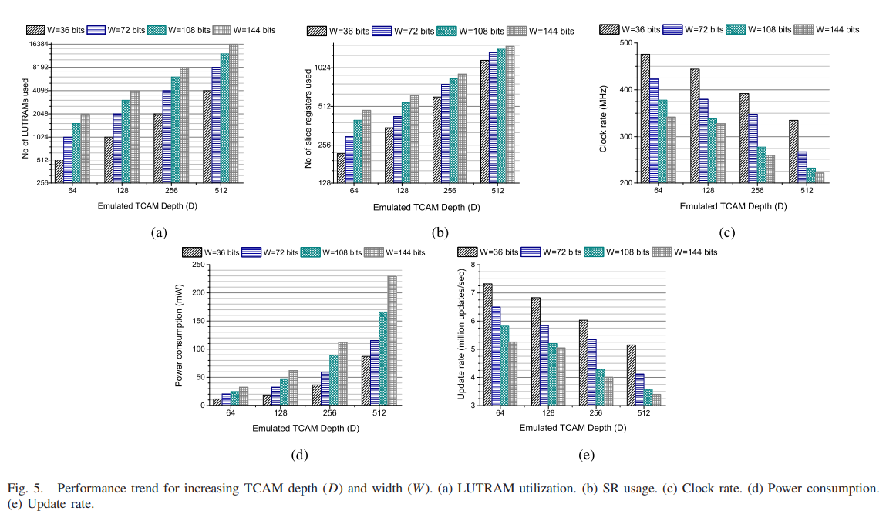

# What limits the size of Open Flow policy

Networking devices use ternary content-addressable memory (TCAM) as a mechanism to quickly route masked messages.

TCAM [operates differently than RAM](https://searchnetworking.techtarget.com/definition/TCAM-ternary-content-addressable-memory), as queries can be issued against the content directly. This is accomplished by each 'bit' can have three states: `On, Off, and Wildcard`.

TCAM memory is (1) expensive to produce; (2) requires significant power; and (3) emits a lot of heat. This limits the amount of TCAM that can is physically available to a device.

## DURE: An Energy- and Resource-Efficient TCAM Architecture for FPGAs With Dynamic Updates (2019)

To work around the challenges of traditional TCAM, the researchers used reconfigurable static RAM on FPGA devices. As routing updates arrived the logic gates were reconfigured to ensure they could emulate the response of a TCAM device.

Their emulation creates two content masks one for the 'on bits' and another for the 'off bits'. If a bit is set to 'wildcard' they enable the bit in both masks. Then they evaluate the `TCAM word` through both masks and perform a `logical AND` operations across the results.

This improves the memory density to 2 x `sizeof(TCAM word)` and allows for look up searchs that are 2.5x faster than traditional TCAM. However there are challenges with updating of the routes. In the worst case an updated route requires all logic gates to be reprogrammed. During a reprogramming a subset of the FPGA must block all I/O until it finishes the apply. The authors stated that this operation can be up to 513 cycles on a modern Xilinx.

In highly dynamic environments such as (1) containerized/serverless computing; (2) Industrial IoT; and (3) dense wireless environments (e.g. convention centers and university campus) -- the routes may require frequent updates and make this route tables inefficient to maintain.

New algorithms are required to partition the traffic such that the fewest reprogramming stages are required. The researchers touched on this problem with a distributed block memory solution, that divides each `mask lookup` across the entire RAM quad port (3 reads/1 write).

