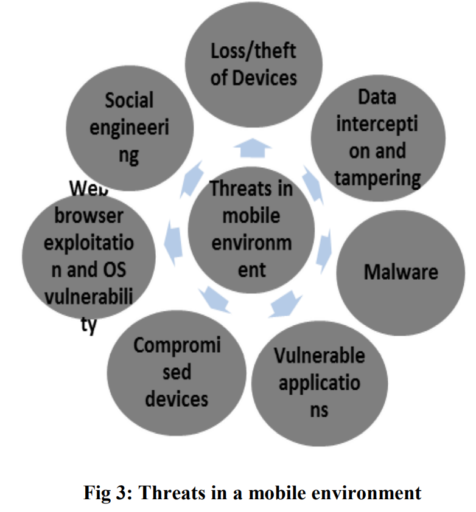

# Readings: Isolation Strategies

## Study of an effective way of Detecting Unexpected Permission Authorization to Mobile Apps (2017)

Authors: Manisha Patil and Prof. Dr.Dhanya Pramod

There are four layers that can be attacked:

- Application Layer
- Operating System Layer
- Hardware Layer
- Infrastructure Layer

## Application Layer

Previous research attempted to monitor the operating system events, such as linux kernel events. Others have used similar telemetry feeds combined with machine learning algorithms.

Researchers have also identified that the number of permissions required for modern applications is increasing. This is resulting in more attack surface through more complex interactions. To further compound these challenges it has been proposed that no one understands the permissions model and resulting in exceess rights.

Some have proposed more granular permission models and allowing the user capabilities to twiddle them off/on. This relies on the user to be deeply technical and would be difficult to implement in pratice.

To protect the application others have created sandboxing and isolation technologies that can be repacked into an existing package. This is an interesting solution and typically repackaing is used for malicious purposes such as advertising revenue hijacking.

More common solutions involve taint flow analysis and decompiling during the installation phase. If the package is detected to be malicious (using heuristics); then it is quarintined or removed. Some anti-virus solutions run the suspicious malware remotely on emulators in the cloud. This enables the AV to monitor the telemetry.

## Research on Android Access Control based on Isolation Mechanism (2016)

Authors: Ying Peng, Mingxin Zhang, Jinlong Zheng, and Zhenjiang Qian

