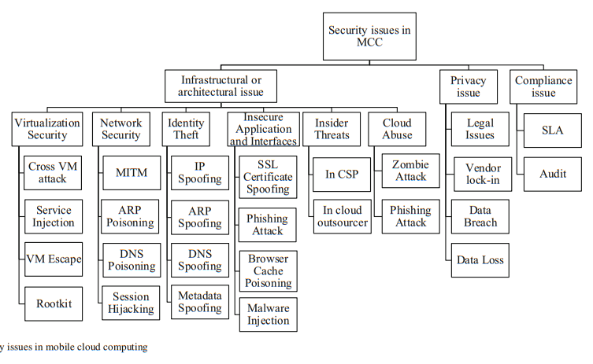

# Readings: Android Landscape

## Malicious app infects 25 million Android devices with 'Agent Smith' malware (2019)

Author: Cat Ferguson

This recent article describes an active attack that is occuring on the Android platform. They highlight how the challenges to patch physical devices has enabled a vulnerability that is nearly 2 years old to continue working.

The challenges stem from first Google must fix the problem, then get the OEM to accept it. Then the OEM needs to publish it so that the service provider can release it. The service provider then needs the user to accept the download and agree to 5-30 minutes of distruption.

It would be advantageous for an alternative solution to exist that allows device owners to receive critical patches automatically and _applyed by default._

These problems are not unique to Android as iOS has its fair share, however those attacks tend to focus on the jail broken devices as it is easier to side load malicious software.

## Extending E-Business Applications Using Mobile Technology (2006)

Authors: Anthony S Atkins AK Hairul Nizam PG HJ Ali, and Hanifa Shah

This article explores the different evolutionary steps that have occurred in mobile computing. They examine the potential of transitioning from tradition

## Data security in mobile cloud computing paradigm: a survey, taxonomy and open research issues (2017)

Authors: Tarunpreet Bhatia, A. K. Verma

The article performs a survey of the attack/defense scenarios that are occuring on the `Mobile Cloud Computing (MCC)` landscape. These scenarios are refering the natural blend of mobile and remote processing that occurs today and will become even more common tomorrow. They argue that this is different than vanilla `Cloud Computing` as it attempts to solve the resource constaint problem -- not fault tolerance nor elastically scaled webapplication scenarios. Instead MCC is attempting to focus on the "private personal cloud experience".

### What are the key security issues for MCC

- Confidentiality
- Integrity
- Authentication
- Non-Repudiation
- Access Control
- Availability

### How are people authenticating

