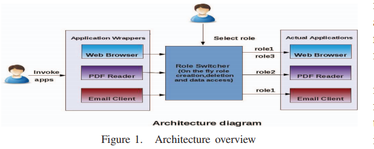
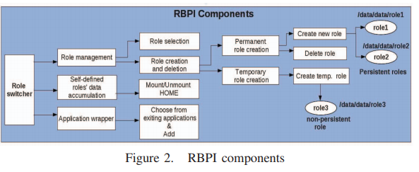

# Reading: Permissions

## Android Permissions Demystified (2011)

Authors: Adrienne Porter Felt, Erika Chin, Steve Hanna, Dawn Song, David Wagner

This article explores the mechanics of Android permissions and discusses the challenges of running with least privileges.

To determine what permissions are actually required, they enabled permission auditing on the Android kernel. Next they generated unit tests and attempted to maximize the code coverage across the official Android SDK.

There were challenges invoking all methods as some required precisely configured data structures or similar memory allocations. Manual tests were created for targeted areas that could not be covered through automation.

Afterwards, they discovered that there are many disconnects between the implementation and the documentation of the required permissions. They suspected some of these were vulnerabilitys and similar elevation paths.

## Role-based Privilege Isolation: A Novel Authorization Model for Android Smart Devices (2011)

Authors: Batsayan Das, Lakshmipadmaja Maddali, and Harshita Vani Nallagonda

The article describes a `Role based Privilege Isolation` model which uses roles to categorize the desired behavior and sharing of data.

While Android already has systems in place for sandboxing applications it does not have protections against the application being compromised, e.g., through cross-site scripting attacks.

They propose creating _multiple personas_ such as "browsing secure banking" versus "random surfing", and then run the applications in the _desired context_. This reduces the attack surface as these different `roles` are isolated from each other.

Most alternative solutions do not address the scenario of an app is compromised, and attacks another instance of itself. Their solution addresses these scenarios by allowing multiple roles per app and therefore limiting the (1) data, (2) permissions, and (3) functional or app usage categorization.

### What is the key idea of this work

The main idea is to have introduce *multiple application contexts* to Android a traditionally "single user model". That is not to say that Android which is based on Linux is truly a single user model (e.g. DOS 1.0) but there is not clear separations between different use cases.

## Figment: Fine-grained Permission Management for Mobile Apps (2019)

Authors: Ioannis Gasparis, Zhiyun Qian, Chengyu Song, Srikanth V. Krishnamurthy, Rajiv Gupta and Paul Yu

Figment uses [Aspect Oriented Programming](https://github.com/dr-natetorious/TIM-8110-Programming_Languages_and_Algorithms/tree/master/Week2_AspectProgramming) to remove the cross cutting concerns around permissions and dynamically enabling those rights. If the users decide not to allow those permissions the application will continue to execute with reduced functionality.

By encapsulting redundant code inside of attribute driven tags the framework is able to inject the code and reduce the overhead on developers. This encourages developers to annotate their code and do the right thing up front.

Another feature looks at the dependency graph and attempts to determine if a revoked permission is critical or ignorable. If it is critical then it prompts the user with a notification that the revoke will result in a crash. Otherwise through _the magic of code weaving_ constructs code paths that avoid the denied invocation.

## An Efficient Implementation of Next Generation Access Control for the Mobile Health Cloud (2018)

Authors: Rejina Basnet, Subhojeet Mukherjee, Vignesh M. Pagadala, and Indrakshi Ray

Mobile Health Care (mHealth) attempts to distribute medical informations in a reliable and privacy safe manner. This includes the need to reach different roles for various user personas-- such as patients, doctors, and insurance companies.

These systems have traditionally relied on `RBAC solutions` as a mechanism to associate different levels of access for these different user scenarios. Alternative implementations have relied on `Attribute Based Access Control (ABAC)` -- such as "employee of legacy hospital" not "role:doctor". Both approaches attempt to solve the same problem by modeling it slightly differently.

To improve on this experience the authors propose a `Policy Machine` that is represented as a directed acyclical graph (DAG). The graph is then used to examine relationships between objects with edges representing the allowances. This enables efficient searching and auditing of the permission model, which is otherwise complex for large distributed environments.

Since the edges can be placed between any unique object this enables scenarios such as "release my cardiovasular records" do not release "my pyschiatric evaluation".
