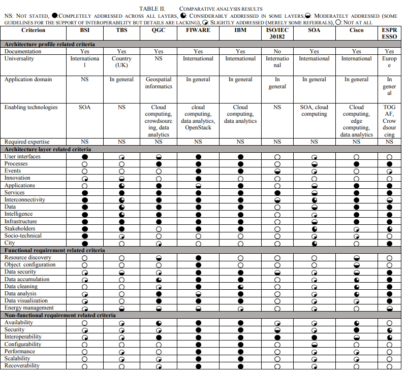

# Smart Cities

## Reasoning about Smart Cities (2018)

Marcello Balduccini, Edward Griffor, Michael Huth, Claire Vishik, Martin Burns, David Wollman [describe](Reasoning_SmartCity.pdf) an approach uses ontology and reasoning techniques, is based on the NIST Framework for Cyber-Physical Systems, and demonstrates how a greater understanding of the interdependencies between concerns (elements of the CPS Framework) can be achieved.

Smart cities require horizontal integrations -- street lights, water pumps, traffic sensors, etc. -- or they would be too complex within a single platform. These _Cyber-Physical SYstems (CPS)_ are by their very nature heterogeneous.

They took an aspect oriented programming approach to building the total ecosystem, and enriched an `ontology equivalent` metaworld full of model representations.

## IoT Smart City Architectures: an Analytical Evaluation (2018)

Fahmideh, M; Zowghi, D [compared](SmartCity_Arch.pdf) the architectual differences of various smart city designs.

- British Standard Institute (BSI): Emphasizes the role of governance, culture, business model innovation, and use of city services.
- Technology Strategy Board (TSB): A key concern is cities’ visions on environmental sustainability
- Open Geospatial Consortium (OGC): A basis for integrating geographical information systems features, sensor observations, and social media in the support
of city governance and service.
  - Heavy focus on CityGML, IndoorGML, and Augmented Reality Markup Language
  - XML + REST everywhere big focus on interop
- FIWARE/Open Agile Smart Citites: European Commissions focusing on realtime context information and developer friendly common APIs
- IBM: Instrumented, Interconnected, and Intelligent architecture for developers to create city services for inhabitants.
- ISO/IEC 30182: Defines notions of organizations, place, metric, service, resource and their relationships.
- Service-Oriented Architecture Model (SOA): Holistic design for integrating systems such as autonomous vehicles, smart grids, and intelligent traffic management
- Cisco: Standardizes concepts and terminologies associated with IoT. Defines collaboration, abstractions, connectivity, and controllers.
- systEmic standardisation apPRoach to Empower Smart citieS and cOmmunities (ESPRESSO): A vendor/prescription free guidance for creating enhanced interoperable and standards-based architectures

## Success of IoT in Smart Cities of India: An empirical analysis (2018)

Sheshadri Chatterjee, Arpan Kumar Kar, M.P. Gupta [report](SmartCity_India.pdf) on the deployment of smart cities into India. Presently there are 100 smart cities that leverage IoT and AI scenarios to provide _Smart Machines_.

In 2015 their government started an initiative to create Information and Communication Technologies; with a heavy focus on Internet and capabilities to interact with physical/virtual objects to perform common actions. The expectation is that everything becomes digital and everyone becomes confident working with IoT scenarios.

They produce massive volumes of data and feed this into oepn AI systems. European smart cities have very distinct opinion with a focus on sustainability.
